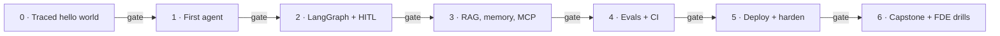

# Production-Grade AI Agents — An FDE Curriculum

> Seven phases, seven shipped artifacts, and a mastery gate between each one.
> Go from *"I use LLMs"* to *"I can design, evaluate, and ship production
> agents on the LangChain / LangGraph / LangSmith stack — and deliver them as
> a service."*

[](pyproject.toml)
[](https://python.langchain.com)
[](https://langchain-ai.github.io/langgraph/)
[](https://smith.langchain.com)
[](https://docs.astral.sh/uv/)
[](#progress-checklist)
[](LICENSE)

**Time:** ~60–70 focused hours · 8 weeks at ~8–9 hrs/week · **hard cap: 2 months**
**Cost:** ~$0 on the default path — local [Ollama](https://ollama.com) models +
LangSmith's free tier (Phase 5's *managed* deployment option needs a paid
plan; the DIY path taught alongside it stays free)
**You finish with:** a deployed, evaluated, monitored capstone agent + a case
study + a demo video — a portfolio that answers the question every FDE
interview and client call comes down to: *"How do you know it works?"*



---

## Why this curriculum exists

The LangChain ecosystem moves fast, so this curriculum optimizes for
**durable skills** — agent architecture, evaluation, observability,
productionization — over memorizing today's API surface. Two things make it
different from the many agent tutorials out there:

1. **Mastery gates.** You don't move to the next phase by finishing the code —
   you move on by *passing a gate*: a build checklist, a closed-book concept
   check with hidden answer keys, and an "explain it to a client" scenario.
   Almost no popular free curriculum gates progression on demonstrated
   understanding; the learning-science evidence says it's one of the
   highest-leverage things a curriculum can do.
2. **Evaluation as the spine, not a module.** The most-asked question in FDE
   interviews (OpenAI's loop literally repeats it) is *"how do you know it
   works?"* Phase 4 exists so you always have a real answer, and every phase
   after it keeps the answer current.

## Who this is for

- **Engineers comfortable in Python** who use LLMs daily but haven't yet
  architected and deployed a **stateful agent to production**. You can read a
  stack trace, use git, and run Docker.
- Especially **infra / SRE / backend folks**: the hardest parts of shipping
  (k8s, observability, reliability, secrets) are already your home turf. Your
  real gaps are narrower — agent application architecture, the LangChain /
  LangGraph / LangSmith APIs, and LLM-specific evaluation — and this plan
  leans into exactly those.
- **Aspiring or interviewing FDEs** (forward-deployed / applied AI /
  solutions engineers). Phase 6's drills mirror the actual interview loops at
  LangChain, OpenAI, and Anthropic: a build-for-a-fictional-customer
  take-home, a discovery-call simulation, and a non-technical presentation.

**Not for you if:** you've never written Python (start with a Python course
first), or you want ML research / model training (this is the *applied
agent-engineering* layer).

## What it costs to run

- **Models: free.** Everything runs on local Ollama (`llama3.1`, or any
  tool-calling model). If your machine is weak, Ollama Cloud or any hosted
  provider works with a one-line `.env` change — budget a few dollars.
- **LangSmith: the free Developer tier** covers this curriculum's tracing,
  datasets, and evaluations (it has monthly trace limits — far above
  learner volume).
- **Phase 5:** the DIY path runs on a local `kind`/`minikube` cluster — no
  cloud bill. The managed path (LangSmith Deployment) requires a paid plan;
  it's presented as the client-engagement option, not a learning
  requirement.

---

## How the phases work

Every phase has the same anatomy, in this order:

1. **Run the worked example.** Each phase folder ships working, commented
   code. Run it, read the trace, break it, fix it.
2. **Modify before you build.** Each phase suggests small modifications
   (swap a tool, change the retrieval k, reject an approval) before you build
   anything from scratch. Friction should be conceptual, not syntactic.
3. **Ship the deliverable.** Every phase ends in a standalone artifact with
   an explicit definition-of-done checklist. No tutorial limbo. These
   artifacts *become your portfolio*.
4. **Pass the gate.** At the end of each phase README:
   - **Build check** — the definition-of-done, as checkboxes.
   - **Concept check** — closed-book questions with answers hidden behind
     collapsible blocks. **Write your answer down before peeking.** Answering
     from memory (then checking) is retrieval practice — the single
     best-supported technique in the learning literature, and it only works
     if you generate the answer *before* seeing it.
   - **FDE scenario** — a "client asks you X" question, because explaining a
     system you built is both how learning consolidates and literally the job.
   - **Pass rule:** all build boxes ticked + at most one concept miss + a
     scenario answer you'd say to a client with a straight face. Miss more?
     Re-run the code the next day and retake the gate. That's the mastery
     loop working, not you failing.
5. **Gates in Phases 4–6 also re-ask earlier material.** Spaced re-testing of
   old concepts is deliberate (it's the second-best-supported technique);
   don't skip those questions just because they feel "done."

<details><summary>The evidence, if you want it</summary>

- **Retrieval practice & spacing** are the only two techniques rated
  "high utility" in the canonical review of ten learning techniques:
  [Dunlosky et al. 2013](https://journals.sagepub.com/doi/abs/10.1177/1529100612453266);
  meta-analysis of the testing effect: [Adesope et al. 2017](https://journals.sagepub.com/doi/abs/10.3102/0034654316689306).
- **Mastery gates** (advance only after passing a criterion, with a
  corrective path) raise outcomes ~0.5 SD across 108 controlled studies:
  [Kulik, Kulik & Bangert-Drowns 1990](https://journals.sagepub.com/doi/10.3102/00346543060002265);
  framing: [Bloom's "2 Sigma Problem"](https://web.mit.edu/5.95/readings/bloom-two-sigma.pdf).
- **Teach-back / explaining** ("learning by teaching") shows d ≈ 0.5–0.8:
  [Kobayashi 2019](https://onlinelibrary.wiley.com/doi/10.1111/jpr.12221) —
  and for an FDE it doubles as job practice.
- **Explicit rubrics** improve self-assessment and self-regulation:
  [Panadero & Jonsson 2013](https://eric.ed.gov/?id=EJ999454).
- Readable trade summary of all of it: *[Make It Stick](https://www.hup.harvard.edu/books/9780674729018)*.

</details>

## The 8-week map

| Week | Phase | Deliverable you ship | Hours |
|------|-------|----------------------|-------|
| 1 | **0 — Foundations** + start **1** | Traced hello-world (tool call + structured output) | ~8 |
| 2 | **1 — First agent** | One agent, 3 real tools, one nested trace | ~8 |
| 3 | **2 — LangGraph** | Rebuilt agent: persistence + approval interrupt | ~10 |
| 4 | **3 — RAG, memory, MCP** | Agent with knowledge base + long-term memory + MCP tool | ~10 |
| 5 | **4 — Evals & observability** | Eval suite + CI regression gate + monitoring | ~10 |
| 6–7 | **5 — Production & deploy** | Hardened agent on k8s (or LangSmith Deployment) | ~12 |
| 7–8 | **6 — Capstone + FDE drills** | Capstone + case study + demo video + drill artifacts | ~12 |

**Behind schedule?** Two checkpoints:

- **End of week 4:** not finished Phase 3 → cut Phase 3's stretch work
  (hybrid search, reranking) and move on; RAG depth is tunable, the spine is
  not.
- **End of week 6:** not finished Phase 5 → take the managed deployment path
  (LangSmith Deployment) instead of DIY k8s, and reclaim a week.
- The non-negotiable spine is **1 → 2 → 4 → 5 → capstone**: build an agent,
  make it stateful, prove it works, ship it. (Phase 3 isn't skipped — it's
  the one phase whose *depth* flexes.) A skipped week shifts the calendar;
  it never reorders the spine.

## Getting started

Install [`uv`](https://docs.astral.sh/uv/) and [Ollama](https://ollama.com),
then from the repo root:

```bash
ollama pull llama3.1                 # any tool-calling model works
uv sync                              # create the venv + install dependencies
cp .env.example .env                 # then set your Ollama + LangSmith values
uv run python -m phase0.hello_agent  # run the Phase 0 starter
uv run pytest                        # run the offline tests
```

Then open [`phase0/README.md`](phase0/README.md) and start the loop:
run → modify → ship → gate.

## Repo layout

```text
.
├── README.md          # this curriculum
├── pyproject.toml     # uv project (dependencies shared across phases)
├── .env.example       # copy to .env and fill in your keys
├── phase0/            # worked example: traced hello-world
├── phase1/            # worked example: first agent via create_agent
├── phase2/            # worked example: LangGraph rebuild (persistence + HITL)
├── phase3/            # worked example: RAG + long-term memory + MCP
├── phase4/            # build guide: evals, CI gate, monitoring
├── phase5/            # build guide: guardrails, reliability, deployment
├── phase6/            # build guide: capstone brief + FDE drills
├── tests/             # offline unit tests for the pure logic in each phase
├── CONTRIBUTING.md    # fixes, questions, and sharing your solutions
└── LICENSE            # MIT (code) — prose is CC BY 4.0, see below
```

Phases 0–3 are **worked examples** (code included — run and modify them).
Phases 4–6 are **build guides** (you write the code — that's the point; by
then you're building, not copying). Every phase folder stands alone, so you
can link someone straight to a phase.

---

## Operating principles

1. **Observability-first.** LangSmith tracing goes on in Phase 0, before
   anything interesting exists. Most learners bolt it on too late; every
   debugging question in this curriculum starts with "open the trace."
2. **Every phase ships a deliverable.** These artifacts are your portfolio,
   and each phase's gate keeps you honest about understanding them.
3. **Evaluation is the differentiator.** Anyone can demo an agent. FDEs get
   hired — and consultants get paid — for proving it works and catching
   regressions before clients do.
4. **Deployment & reliability are the moat.** Plenty of people "know
   LangChain." Few can ship a stateful, observable, autoscaling agent and
   answer the enterprise questions (isolation, approvals, data residency)
   that follow.
5. **Tiered model routing for cost.** Learn the stack model-agnostic, then
   build your cost story around routing by difficulty: a cheap/fast tier for
   routing and evals, a workhorse for the agent loop, a top reasoning tier
   for the hardest steps.

---

## The curriculum

### Phase 0 — Foundations & mental model · ~3 evenings · [`phase0/`](phase0/README.md)

Solidify the API-level model of LLM apps — you use them daily; now understand
them as primitives.

- Tokens, context windows, temperature, **structured output (Pydantic)**, and
  **tool / function calling** — the bedrock every agent is built on.
- Setup: `uv`, Python 3.11+, Ollama (or any provider), and a **LangSmith
  account with tracing env vars** — on from day one.
- **Deliverable:** a traced "hello world" — one chat call that makes one tool
  call and returns structured output, fully visible in a LangSmith trace.
- **Gate:** [phase0/README.md → Phase gate](phase0/README.md#phase-gate--pass-this-before-phase-1)

### Phase 1 — LangChain core + your first agent · ~Week 2 · [`phase1/`](phase1/README.md)

- Chat models, messages, prompt templates, structured output, **tool
  definition & binding**.
- **`create_agent`** — the standard tool-calling agent loop (import from
  `langchain.agents`; the older `langgraph.prebuilt.create_react_agent` is
  deprecated). Middleware is a Phase 5 topic; here you learn the loop itself.
- **LangSmith trace-reading as a debugging skill:** runs, threads, latency,
  token counts — and why the whole run is *one nested tree*.
- Tool safety: why every tool argument is untrusted input.
- **Deliverable:** a single agent calling 2–3 *real* tools (HTTP fetch +
  calculator + word count), fully traced.
- **Gate:** [phase1/README.md → Phase gate](phase1/README.md#phase-gate--pass-this-before-phase-2)

### Phase 2 — LangGraph: the production agent runtime · ~Week 3 · [`phase2/`](phase2/README.md)

The framework you'll actually ship. It's a state machine — natural territory
if you have an infra background. **The most important build week.**

- `StateGraph`: state schema, reducers, nodes, edges, **conditional routing,
  cycles** — the same loop as Phase 1, now with the machinery visible.
- **Persistence / checkpointers** (`MemorySaver` → **`PostgresSaver`**),
  threads, short-term memory. (Docs now call the in-memory one
  `InMemorySaver`; same thing.)
- **Human-in-the-loop:** `interrupt()` + `Command(resume=...)` — approval
  gates before risky actions, and why resume *replays the node*. Enterprises
  require this; you'll build it by hand so the packaged
  `HumanInTheLoopMiddleware` (Phase 5) is never magic to you.
- **Streaming** (tokens, steps) and **time-travel / replay** debugging.
- **Deliverable:** the Phase 1 agent rebuilt as an explicit graph with
  persistence + one approval interrupt gating a write action.
- **Gate:** [phase2/README.md → Phase gate](phase2/README.md#phase-gate--pass-this-before-phase-3)

### Phase 3 — RAG, memory & tools at production quality · ~Week 4 · [`phase3/`](phase3/README.md)

- **RAG pipeline:** loaders → chunking → embeddings → vector store
  (**`pgvector`** if you already run Postgres) → retrieval; stretch: hybrid
  search + reranking.
- **Long-term memory** via the LangGraph `Store` — cross-thread memory, and
  the multi-tenancy trap (per-user namespaces) every client will ask about.
- **MCP integration** with `langchain-mcp-adapters` — wire an MCP server in
  as agent tools (stdio locally; streamable HTTP is the remote standard).
- **Deliverable:** an agent with a real knowledge base + long-term memory +
  one MCP-backed tool.
- **Gate:** [phase3/README.md → Phase gate](phase3/README.md#phase-gate--pass-this-before-phase-4)

### Phase 4 — Evaluation & observability: the FDE differentiator · ~Week 5 · [`phase4/`](phase4/README.md) · **do not skip**

The SLO mindset applied to agents: *"here's proof it works, and here's how
we'll know if it regresses."*

- **LangSmith datasets, experiments, `evaluate()`** — plus the open-source
  evaluator libraries **`openevals`** (LLM-as-judge, RAG groundedness) and
  **`agentevals`** (**trajectory evals** — did the agent take the right
  *steps*, not just give the right answer?).
- **Regression gating in CI** (pytest + LangSmith) — block merges on eval
  scores.
- **Online evaluation & monitoring:** dashboards, cost & latency tracking,
  **annotation queues** — and the production loop: annotated bad trace →
  dataset example → regression test.
- **Deliverable:** an eval suite + a CI gate that blocks regressions + a
  monitoring view. *This single deliverable is your strongest sales asset.*
- **Gate:** [phase4/README.md → Phase gate](phase4/README.md#phase-gate--pass-this-before-phase-5)

### Phase 5 — Productionization & deployment · ~Weeks 6–7 · [`phase5/`](phase5/README.md)

- **Guardrails & reliability as middleware:** `HumanInTheLoopMiddleware`,
  `PIIMiddleware`, model fallbacks & retries, tool retries, call limits —
  plus prompt-injection defense in depth, timeouts, and model routing.
- **Deployment — two paths, pick per client:**
  - *Managed:* **LangSmith Deployment** (the platform formerly called
    LangGraph Platform) — `langgraph dev` locally, `langgraph deploy` to
    ship; least ops. [Agent Chat UI](https://github.com/langchain-ai/agent-chat-ui)
    gives you a front end for free.
  - *DIY (your moat):* **FastAPI + LangGraph + `PostgresSaver` + Redis**,
    containerized, on k8s (`kind` is fine) with HPA, secrets, SSE streaming,
    health probes, and **multi-tenant isolation**.
- **Deliverable:** your agent deployed with persistence, autoscaling,
  secrets, and end-to-end tracing — and it survives a pod kill mid-approval.
- **Gate:** [phase5/README.md → Phase gate](phase5/README.md#phase-gate--pass-this-before-phase-6)

### Phase 6 — Capstone + the FDE layer · ~Weeks 7–8 · [`phase6/`](phase6/README.md)

- **Capstone:** one end-to-end vertical agent built against a **fictional
  client brief** (provided — or bring your own), exercising the whole stack:
  LangGraph + RAG + memory + HITL + evals + deployed + monitored.
- **FDE drills** — the skills that turn a skill set into a service, drilled
  the way interviews test them: a **discovery-call roleplay**, a timed
  **decomposition case study**, a **non-technical presentation**, and a
  **packaging/pricing one-pager**.
- **Deliverable:** capstone repo + one-page case study + 3-minute demo video.
  This trio *is* your sales kit — and your interview take-home rehearsal.
- **Gate:** [phase6/README.md → Final gate](phase6/README.md#final-gate--the-whole-loop) —
  a cumulative check across all seven phases.

---

## The FDE layer — what the market actually tests

Technical depth gets you a working agent. These get you hired — or paid.
(Phase 6 drills all four; the sources are real 2025–26 interview loops and
job postings.)

- **Discovery & scoping** — turning *"can AI do X for us?"* into a concrete
  agent spec with success criteria. Anthropic's applied-AI loop runs a
  simulated discovery call — and it filters out most candidates who passed
  the coding rounds. The failure mode is always the same: pitching instead
  of asking.
- **Decomposition under ambiguity** — the make-or-break interview round at
  OpenAI and elsewhere: vague enterprise problem → clarifying questions →
  assumptions → walking skeleton → eval plan. Jumping straight to
  architecture is the #1 rejection reason.
- **Demo-driven delivery** — ship a rough working demo in days, iterate with
  the client in the loop, and always demo with the trace open ("watch it,"
  not "trust me").
- **"How do you know it works?"** — your Phase 4 eval suite is the answer,
  every time: datasets from real traces, regression gates in CI, monitoring
  after ship.
- **Enterprise constraints** — SSO, VPC deployment, PII handling, data
  residency, SOC 2 conversations, multi-tenant isolation. Have answers
  before they ask.
- **Pricing, packaging & handoff** — fixed-scope build vs. retainer vs.
  outcome-based; docs, runbooks, and a maintainability story (an ops
  background is a selling point here).

---

## After the curriculum

Things worth knowing exist, deliberately left out of the 8 weeks:

- **[`deepagents`](https://docs.langchain.com/oss/python/deepagents/overview)** —
  LangChain's opinionated agent harness (planning, subagents, virtual
  filesystem). After Phase 2 you'll understand exactly what it packages.
- **Multi-agent patterns** (supervisor / swarm) — add when a client's problem
  actually shapes that way; single well-evaluated agents win most engagements.
- **[A2A](https://a2a-protocol.org)** (agent-to-agent protocol) and the
  evolving MCP spec — track them; enterprises are starting to ask.
- **TypeScript** — most FDE postings pair Python with JS/TS. Port your
  capstone's API layer when you're job-hunting.
- **LangSmith's agent-improvement products** (Insights Agent, Polly,
  Engine) — the managed version of the eval loop you built by hand in
  Phase 4.

## Curated resources

*(Free unless noted. The ecosystem moves fast — treat official docs as
primary. Verified July 2026.)*

- **[LangChain Academy](https://academy.langchain.com/)** — *Introduction to
  LangGraph* is the single best use of your early hours. Newer:
  *Introduction to Agent Observability & Evaluations* (pairs with Phase 4),
  *Introduction to LangSmith Deployment* (pairs with Phase 5), and the
  project courses (*Deep Agents*, *Ambient Agents*, *Deep Research*).
- **Official docs** — [LangGraph](https://docs.langchain.com/oss/python/langgraph/overview)
  (concepts + how-tos), [LangSmith evaluation](https://docs.langchain.com/langsmith/evaluation),
  [middleware](https://docs.langchain.com/oss/python/langchain/middleware),
  [`openevals`](https://github.com/langchain-ai/openevals) /
  [`agentevals`](https://github.com/langchain-ai/agentevals).
- **[DeepLearning.AI short courses](https://www.deeplearning.ai/courses)** —
  *AI Agents in LangGraph*, *Long-Term Agentic Memory with LangGraph*, and
  the evals courses.
- **[Hugging Face Agents Course](https://huggingface.co/learn/agents-course/en/unit0/introduction)** —
  good complementary breadth (other frameworks) + a free certificate.
- **FDE career prep** — [Exponent's FDE interview guide](https://www.tryexponent.com/blog/forward-deployed-engineer-interview-the-definitive-2026-guide-fde),
  [Hamel Husain's evals field guide](https://hamel.dev/blog/posts/field-guide/),
  [Sierra's Agent Development Life Cycle](https://sierra.ai/blog/agent-development-life-cycle),
  [a16z on FDEs & services-led growth](https://a16z.com/services-led-growth/),
  [Nabeel Qureshi's *Reflections on Palantir*](https://nabeelqu.co/reflections-on-palantir).
- **LangSmith Studio** (formerly LangGraph Studio) — the visual agent
  debugger; install during Phase 2.

## Stack & versions

`Python 3.11 + uv` · `langchain 1.3.x` + `langgraph 1.x` + a provider
integration (`langchain-ollama` here) · `langsmith` · `langchain-mcp-adapters`
· `openevals` + `agentevals` (Phase 4) · `pgvector` on Postgres · `FastAPI`
for serving · `pytest` for eval CI · `Helm`/k8s or LangSmith Deployment for
Phase 5.

The lockfile pins exact versions this repo was tested with. If you upgrade,
re-run the phase demos — the 1.x line is stable for everything taught here,
but middleware signatures have churned between minors.

---

## Progress checklist

Gate passed = build boxes ticked **and** concept check cleared **and**
scenario answered. Be honest — nobody's grading you but the next client.

- [x] **Phase 0** — Traced "hello world" (tool call + structured output)
- [x] **Phase 1** — Single agent calling 2–3 real tools, one nested trace
- [x] **Phase 2** — LangGraph rebuild with persistence + approval interrupt
- [ ] **Phase 3** — Agent with knowledge base + long-term memory + MCP tool
- [ ] **Phase 4** — Eval suite + CI regression gate + monitoring
- [ ] **Phase 5** — Agent deployed with persistence, autoscaling, tracing
- [ ] **Phase 6** — Capstone + case study + demo video + FDE drill artifacts

## Using or sharing this curriculum

- **Fork it and work through it** — the checklists above become your tracker.
  Working with a friend or posting weekly progress publicly measurably
  improves follow-through; treat it as part of the method.
- **Teach with it** — run it as a study group or internal cohort; each phase
  folder stands alone. Attribution appreciated.
- **Contribute** — fixes, sharper gate questions, and better scenarios are
  welcome; see [CONTRIBUTING.md](CONTRIBUTING.md). Finished the capstone?
  Open a PR adding a link to yours in `phase6/completions.md`.
- **License:** code is [MIT](LICENSE); prose (READMEs, questions, answer
  keys) is [CC BY 4.0](https://creativecommons.org/licenses/by/4.0/) —
  reuse freely with attribution.

---

*Curriculum drafted with Claude Code. Research-checked July 2026.*
