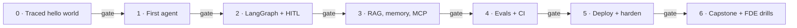

# Production-Grade AI Agents — An FDE Curriculum

> Seven phases, seven shipped artifacts, and a mastery gate for each one.
> Go from *"I use LLMs"* to *"I can design, evaluate, and ship production
> agents on the LangChain / LangGraph / LangSmith stack — and deliver them as
> a service."*

[](pyproject.toml)
[](https://docs.langchain.com/oss/python/langchain/overview)
[](https://docs.langchain.com/oss/python/langgraph/overview)
[](https://smith.langchain.com)
[](https://docs.astral.sh/uv/)
[](LICENSE)

**Time:** ~60–70 focused hours · 8 weeks at ~8–9 hrs/week · **hard cap: 2 months**
**Cost:** ~$0 on the default path — local [Ollama](https://ollama.com) models +
LangSmith's free tier ([the one exception](#what-it-costs-to-run))
**You finish with:** a deployed, evaluated, monitored capstone agent + a case
study + a demo video — a portfolio that answers the question every FDE
interview and client call comes down to: *"How do you know it works?"*



---

## Why this curriculum exists

The LangChain ecosystem moves fast, so this curriculum optimizes for
**durable skills** — agent architecture, evaluation, observability,
productionization — over memorizing today's API surface. Three things make it
different from the many agent tutorials out there:

1. **Mastery gates, and a lot of them.** You don't advance by finishing the
   code — you advance by *passing a gate*: a build checklist, a closed-book
   concept check with hidden answer keys, and an "explain it to a client"
   scenario. Across the seven gates that's **32 closed-book concept questions
   and 6 client-facing FDE scenarios — 38 hidden answer keys in all**, with
   later gates deliberately re-asking earlier phases (Phase 4 returns to 2 and
   3; Phase 5 to 0, 1 and 4; Phase 6 asks one per phase). Few
   popular free curricula gate progression on demonstrated understanding,
   and the [learning-science evidence](docs/evidence.md) says it's one of the
   highest-leverage things a curriculum can do.
2. **Evaluation as the spine, not a module.** The most-asked question in FDE
   interviews is *"how do you know it works?"* Phase 4 exists so you always
   have a real answer, and every later phase keeps it current. Anyone can demo
   an agent; FDEs get hired — and consultants get paid — for proving it works
   and catching regressions before the client does.
3. **Observability first, deployment as the moat.** Tracing goes on in Phase 0,
   before anything interesting exists, so every debugging question here starts
   with "open the trace." And plenty of people "know LangChain" — few can ship
   a stateful, observable, autoscaling agent and answer the enterprise
   questions (isolation, approvals, data residency) that follow. Every phase
   ends in a standalone artifact, so the moat doubles as your portfolio.

## Who this is for

- **Engineers comfortable in Python** who use LLMs daily but haven't yet
  architected and deployed a **stateful agent to production**. You can read a
  stack trace, use git, and run Docker.
- Especially **infra / SRE / backend folks**: the hardest parts of shipping
  (k8s, observability, reliability, secrets) are already your home turf. Your
  real gaps are narrower — agent application architecture, the LangChain /
  LangGraph / LangSmith APIs, and LLM-specific evaluation — and this plan
  leans into exactly those.
- **Aspiring or interviewing FDEs** (forward-deployed / applied AI /
  solutions engineers). Phase 6's drills mirror the rounds applied-AI
  interview loops reportedly run: a build-for-a-fictional-customer
  take-home, a discovery-call simulation, and a non-technical presentation.

**Not for you if:** you've never written Python (start with a Python course
first), or you want ML research / model training (this is the *applied
agent-engineering* layer).

## What it costs to run

- **Models: free.** Everything runs on local Ollama (`llama3.1`, or any
  tool-calling model). If your machine is weak, Ollama Cloud or any hosted
  provider works with a one-line `.env` change — budget a few dollars.
- **LangSmith: the free Developer tier** covers this curriculum's tracing,
  datasets, and evaluations (it has monthly trace limits — far above
  learner volume).
- **Phase 5:** the DIY path runs on a local `kind`/`minikube` cluster — no
  cloud bill. The managed path (LangSmith Deployment) requires a paid plan;
  it's presented as the client-engagement option, not a learning
  requirement.

---

## How the phases work

Every phase has the same anatomy, in this order:

1. **Run the worked example.** Phases 0–3 ship working, commented code: run
   it, read the trace, break it, fix it. Phases 4–6 are build guides — you
   write the code, which by then is the point.
2. **Modify before you build.** Each phase suggests small modifications
   (swap a tool, change the retrieval k, reject an approval) before you build
   anything from scratch. Friction should be conceptual, not syntactic.
3. **Ship the deliverable.** Every phase ends in a standalone artifact with
   an explicit definition-of-done checklist. No tutorial limbo. These
   artifacts *become your portfolio*.
4. **Pass the gate.** At the end of each phase README:
   - **Build check** — the definition-of-done, as checkboxes.
   - **Concept check** — closed-book questions with answers hidden behind
     collapsible blocks. **Write your answer down before peeking.** Answering
     from memory (then checking) is retrieval practice — the single
     best-supported technique in the learning literature, and it only works
     if you generate the answer *before* seeing it.
   - **FDE scenario** — a "client asks you X" question, because explaining a
     system you built is both how learning consolidates and literally the job.
   - **Pass rule:** all build boxes ticked + at most one concept miss + a
     scenario answer you'd say to a client with a straight face. Miss more?
     Re-run the code the next day and retake the gate. That's the mastery
     loop working, not you failing.
5. **Gates in Phases 4–6 also re-ask earlier material.** Spaced re-testing of
   old concepts is deliberate (it's the second-best-supported technique);
   don't skip those questions just because they feel "done."

## The 8-week map

| Week | Phase | Deliverable you ship | Hours |
|------|-------|----------------------|-------|
| 1 | **0 — Foundations** + start **1** | Traced hello-world (tool call + structured output) | ~8 |
| 2 | **1 — First agent** | One agent, 3 real tools, one nested trace | ~8 |
| 3 | **2 — LangGraph** | Rebuilt agent: persistence + approval interrupt | ~10 |
| 4 | **3 — RAG, memory, MCP** | Agent with knowledge base + long-term memory + MCP tool | ~10 |
| 5 | **4 — Evals & observability** | Eval suite + CI regression gate + monitoring | ~10 |
| 6–7 | **5 — Production & deploy** | Hardened agent on k8s (or LangSmith Deployment) | ~12 |
| 7–8 | **6 — Capstone + FDE drills** | Capstone + case study + demo video + drill artifacts | ~12 |

**Behind schedule?** Two triage checkpoints, and one rule that outranks both:

- **End of week 4:** not finished Phase 3 → cut Phase 3's stretch work
  (hybrid search, reranking) and move on; RAG depth is tunable, the spine is
  not.
- **End of week 6:** not finished Phase 5 → take the managed deployment path
  (LangSmith Deployment) instead of DIY k8s, and reclaim a week.
- **The rule:** the non-negotiable spine is **1 → 2 → 4 → 5 → capstone** —
  build an agent, make it stateful, prove it works, ship it. (Phase 3 isn't
  skipped — it's the one phase whose *depth* flexes.) A skipped week shifts
  the calendar; it never reorders the spine.

---

## Getting started

### Prerequisites

All of it is needed *before* the first command, not discovered mid-phase.

- **[`uv`](https://docs.astral.sh/uv/)** — it provisions the interpreter too,
  so you don't install Python yourself. `pyproject.toml` requires **≥ 3.11**;
  `.python-version` pins **3.12**, which is what `uv` fetches and what the
  tests run on.
- **A tool-calling model.** Default is local **[Ollama](https://ollama.com)** —
  install it, then make sure `ollama serve` is running. The model *must*
  support tool calling; if it doesn't, Phase 0 prints `note: the model answered
  without calling the tool this time.` and no tool call reaches the trace.
- **A [LangSmith](https://smith.langchain.com) API key** — free Developer
  tier, *Settings → API Keys*. Tracing is on from Phase 0; it isn't
  decoration, it's the debugging surface every later gate asks you to read.
  (**Docker** isn't needed until Phase 5, but that phase assumes it.)

### Install and run

```bash
ollama pull llama3.1                 # any tool-calling model works
ollama pull nomic-embed-text         # optional prefetch — not used until Phase 3

uv sync                              # create the venv + install the lockfile
cp .env.example .env                 # then fill it in — see just below

uv run python -m phase0.hello_agent  # run the Phase 0 starter
uv run pytest                        # 37 offline tests — no model, no network
```

`.env.example` is annotated and lists every variable. Three of them bite:
`LANGSMITH_API_KEY` must be a real key before your first run (the placeholder
403s — see below), `MODEL` must be a tool-calling model, and `EMBED_MODEL`
(default `nomic-embed-text`) is read from Phase 3 onward. For a hosted
provider instead of local Ollama, `OLLAMA_BASE_URL` + `OLLAMA_API_KEY` is the
one-line switch.

### If something's off

- **`Failed to multipart ingest runs: … 403 … Forbidden`, every run.** Your
  `LANGSMITH_API_KEY` is still the `lsv2_...` placeholder from `.env.example`
  — that literal value really does 403. The agent still answers and still
  prints `✅ Traced` (export is a fail-open background job), but there's no
  trace to open, and the trace is what every gate asks you to read.
- **The model answers without calling the tool.** `MODEL` doesn't support tool
  calling, or is too small to use it reliably. Try `llama3.1`, `qwen2.5`, or a
  Cloud model like `gpt-oss:20b`.
- **Phase 3 fails on embeddings.** `ollama pull nomic-embed-text`.
- **`uv sync --locked` fails** (that's what CI runs). `uv.lock` is stale
  relative to `pyproject.toml`: run plain `uv sync`, commit the lockfile.
  CI deliberately uses `--locked` rather than `--frozen` so a stale lock fails
  loudly instead of installing quietly.

Then open [`phase0/README.md`](phase0/README.md) and start the loop:
**run → modify → ship → gate.**

---

## The curriculum

Each phase README is self-contained *as a document* — link someone straight to
one and they can follow it. The **code** builds up: Phase 2 imports Phase 1's
tools, and Phases 4–6 work against your Phase 3 agent.

| Phase | What you learn and build | You ship | When |
|---|---|---|---|
| [**0 · Foundations**](phase0/README.md) | Tokens, context windows, temperature, structured output (Pydantic), tool calling — and LangSmith tracing wired on day one | A traced hello-world: one chat call, one tool call, structured output | Week 1 · ~8h |
| [**1 · First agent**](phase1/README.md) | `create_agent` and the tool-calling loop, tool definition and binding, reading a nested trace as a debugging skill, treating every tool argument as untrusted input | One agent calling 3 real tools (HTTP fetch, calculator, word count), fully traced | Week 2 · ~8h |
| [**2 · LangGraph**](phase2/README.md) | `StateGraph`, reducers, conditional routing and cycles; checkpointers and threads; `interrupt()` + `Command(resume=…)`; streaming and time-travel replay. **The most important build week.** | The Phase 1 agent rebuilt as an explicit graph, with persistence and one approval interrupt gating a write | Week 3 · ~10h |
| [**3 · RAG, memory, MCP**](phase3/README.md) | Loaders → chunking → embeddings → vector store → retrieval; cross-thread memory via the LangGraph `Store` and the multi-tenancy trap; MCP tools via `langchain-mcp-adapters` | An agent with a real knowledge base, long-term memory, and one MCP-backed tool | Week 4 · ~10h |
| [**4 · Evals & observability**](phase4/README.md)<br>**do not skip** | LangSmith datasets, experiments and `evaluate()`; `openevals` and `agentevals` (trajectory evals); regression gating in CI; annotation queues and the bad-trace → dataset → test loop | An eval suite + a CI gate that blocks regressions + a monitoring view. *Your strongest sales asset.* | Week 5 · ~10h |
| [**5 · Production & deploy**](phase5/README.md) | Guardrails as middleware, fallbacks, retries, call limits, prompt-injection defense in depth; then two deployment paths — managed (LangSmith Deployment) or DIY (FastAPI + `PostgresSaver` + Redis on k8s) | Your agent deployed with persistence, autoscaling, secrets and end-to-end tracing — surviving a pod kill mid-approval | Weeks 6–7 · ~12h |
| [**6 · Capstone + FDE drills**](phase6/README.md) | One vertical agent against a fictional client brief, exercising the whole stack — plus four drills: discovery call, timed decomposition case, non-technical presentation, packaging one-pager | Capstone repo + one-page case study + 3-minute demo video + the four written drill artifacts. The repo–case-study–video trio *is* your sales kit. | Weeks 7–8 · ~12h |

The rest lives in `docs/`: the [full syllabus](docs/curriculum.md) (every
topic, every gate link, repo layout) · the
[learning-science evidence](docs/evidence.md) behind the gates · [what to learn
after Phase 6, and the curated reading list](docs/resources.md).

---

## The FDE layer — what the market actually tests

Technical depth gets you a working agent. These get you hired — or paid. Phase
6 drills four of them directly: discovery call, decomposition case,
non-technical presentation, packaging one-pager.
*Sourcing: reported experience from 2025–26 FDE loops and job postings, not a
cited study. Weight it accordingly.*

- **Discovery & scoping** — turning *"can AI do X for us?"* into a concrete
  agent spec with success criteria. Applied-AI loops commonly include a
  simulated discovery call, and it's reportedly where many candidates who
  cleared the coding rounds come unstuck. The failure mode people describe is
  always the same: pitching instead of asking.
- **Decomposition under ambiguity** — the round that decides a lot of loops:
  vague enterprise problem → clarifying questions → assumptions → walking
  skeleton → eval plan. Jumping to architecture before asking is a common
  rejection reason.
- **Demo-driven delivery** — ship a rough working demo in days, iterate with
  the client in the loop, and always demo with the trace open ("watch it,"
  not "trust me").
- **"How do you know it works?"** — your Phase 4 eval suite is the answer,
  every time: datasets from real traces, regression gates in CI, monitoring
  after ship.
- **Enterprise constraints** — SSO, VPC deployment, PII handling, data
  residency, SOC 2 conversations, multi-tenant isolation. Have answers
  before they ask.
- **Pricing, packaging & handoff** — fixed-scope build vs. retainer vs.
  outcome-based; docs, runbooks, and a maintainability story (an ops
  background is a selling point here).

## Stack & versions

`Python ≥3.11` (3.12 pinned in `.python-version`) `+ uv` · `langchain 1.x` +
`langgraph 1.x` + a provider integration (`langchain-ollama` here) ·
`langsmith` · `langchain-mcp-adapters` · `pytest`. `pyproject.toml` declares
the ranges, both core frameworks bounded `<2` so a fresh `uv sync` never
silently jumps a major; **`uv.lock` pins what was actually tested** —
`langchain` 1.3.9, `langgraph` 1.2.5, `langsmith` 0.8.16, `langchain-ollama`
1.1.0, `langchain-mcp-adapters` 0.3.0, `mcp` 1.28.1. If you upgrade, re-run the
phase demos: the 1.x line is stable for everything taught here, but middleware
signatures have churned between minors.

Phases 4–6 add dependencies **you install as you build** — `openevals` and
`agentevals` in Phase 4; `pgvector`/Postgres, FastAPI, Redis and Helm/k8s in
Phase 5. They are deliberately *not* in the lockfile: choosing and installing
that stack is part of the work. And one architectural note that pays for
itself — **model routing is a cost lever**: a cheap/fast tier for routing and
evals, a workhorse for the agent loop, a top reasoning tier for the hardest
steps.

---

## Progress checklist

Every box starts empty — **these are yours, tick them as you go.** Gate
passed = build boxes ticked **and** concept check cleared **and** scenario
answered. Be honest; nobody's grading you but the next client.

- [ ] **Phase 0** — Traced "hello world" (tool call + structured output)
- [ ] **Phase 1** — Single agent calling 3 real tools, one nested trace
- [ ] **Phase 2** — LangGraph rebuild with persistence + approval interrupt
- [ ] **Phase 3** — Agent with knowledge base + long-term memory + MCP tool
- [ ] **Phase 4** — Eval suite + CI regression gate + monitoring
- [ ] **Phase 5** — Agent deployed with persistence, autoscaling, tracing
- [ ] **Phase 6** — Capstone + case study + demo video + FDE drill artifacts

## Using or sharing this curriculum

- **Fork it and work through it** — the checklist above becomes your tracker.
  Working with a friend or posting weekly progress publicly tends to
  improve follow-through; treat it as part of the method.
- **Teach with it** — run it as a study group or internal cohort; each phase
  README is self-contained as a document, so you can hand out one at a time.
  Attribution appreciated.
- **Contribute** — fixes, sharper gate questions, and better scenarios are
  welcome; see [CONTRIBUTING.md](CONTRIBUTING.md), including the PR gate's
  `docs/features/` + `docs/summaries/` requirement. Finished the capstone? Add
  a link to yours in [`phase6/completions.md`](phase6/completions.md).
- **License:** [MIT](LICENSE) — which by its own wording covers "this software
  and associated documentation files," so the code *and* the prose. Reuse
  freely; keep the copyright notice.

---

*Curriculum drafted with Claude Code. Research-checked July 2026.*
